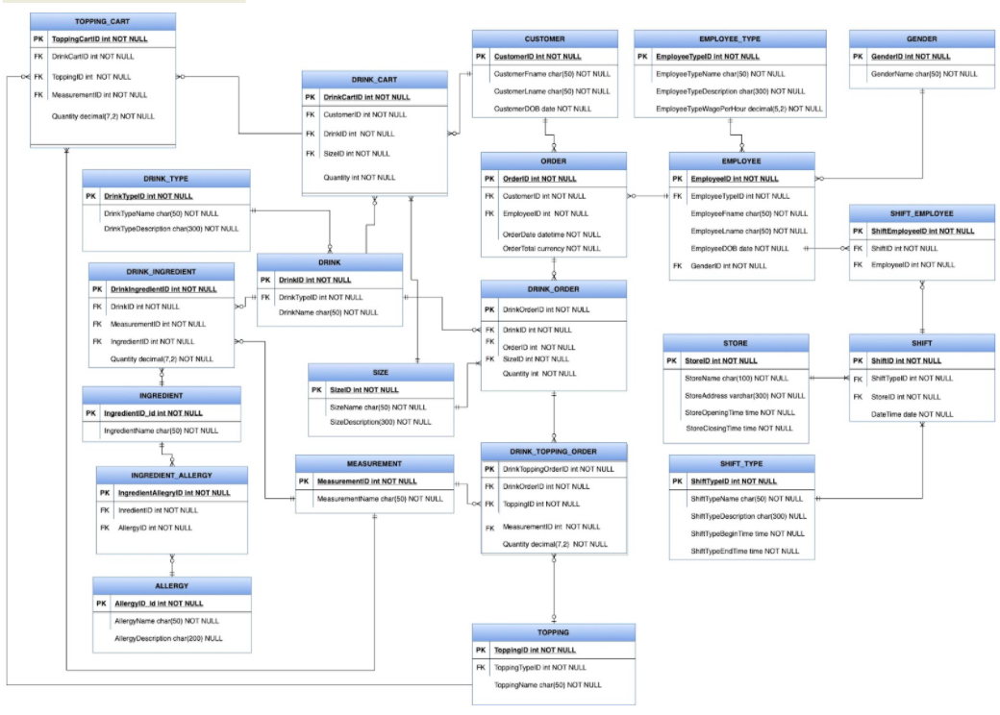

# Team 4: ShareTea Database Project
By: Annie Liu, Daniel Pham, Jonathan Thomas, Lauren Ng 

INFO 430 Fall 2021 With Greg Hay 

# Purpose
The Sharetea franchise currently has over 300 locations and is receiving orders from a number of sources: in-person orders, online food delivery services, and over the phone. By having a database, it will reduce inaccurate/lost orders, reduce customer wait time, and provide important insights on sales (e.g., most popular drinks and toppings). The database will allow each Sharetea store to save money by implementing a more cost-effective *just-in-time (JIT) inventory system*. This will give us insight into the supply chain (e.g., buying products, knowing what to anticipate, etc.) and allow Sharetea to better capitalize on targeted promotions for different customer segments. Sharetea also has the opportunity to increase accessibility to products through online orders, which in turn increases the number of sales and Sharetea’s overall revenue. These efficiencies and new market opportunities will reduce costs and increase revenue (~8% = $160 per day) to provide Sharetea with a total higher net profit.

# ERD Diagram 

Here is a full diagram of our shareTea database that includes data on ingredient inventory, drink orders, employee management, and customer data. 

# Organization of Files
Our code has been seperated into different sql files based on its purpose. The following is where you'll expect to find the requi
- **create_procs_project04.sql** = Stored Procedures 
- **create_tables_project04.sql** = Create all tables
- **populate_tables_project04.sql** = adding data to the created tables using stored procedures and synthetic transactions
- **business_rules_project04.sql** = business rules for tables 
- **computed_cols_project04.sql** = computed columns
- **complex_queries_project04.sql** = complex queries 
- **views_project04.sql** = complex query views to create data visualizations. 
- **backup_database_project04.sql** = code to backup the database 
